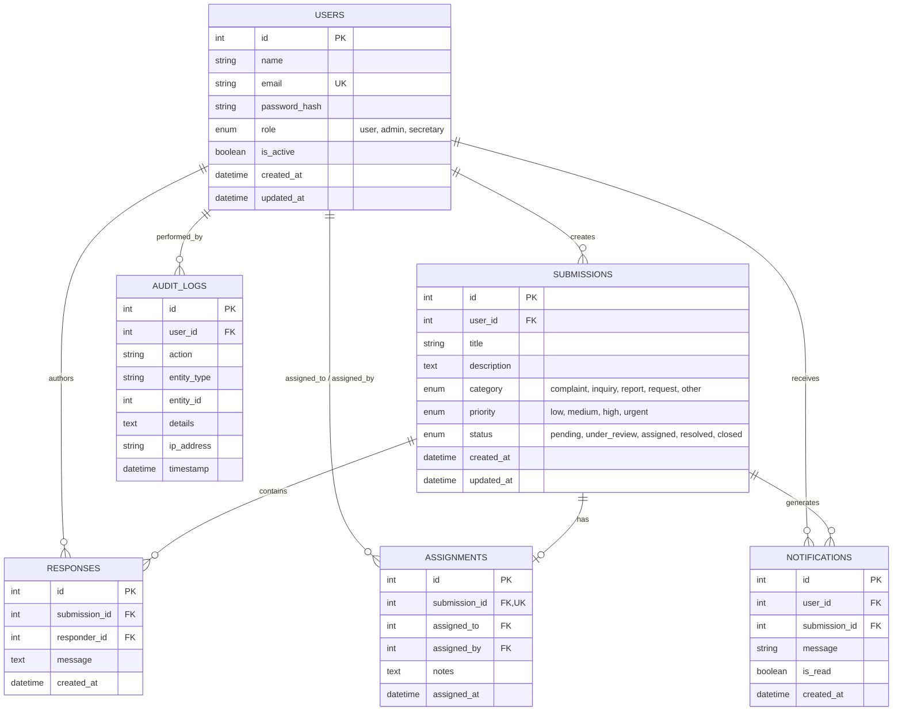

# Database Design & Schema

The system uses **PostgreSQL** with SQLAlchemy ORM and Alembic migrations.

---

## Entity Relationship (ER) Diagram

---

## Table Specifications

### 1. `users`
Stores user credentials, access privileges, and account status.

| Column | Type | Constraints | Description |
|---|---|---|---|
| `id` | SERIAL | PRIMARY KEY | Unique identifier |
| `name` | VARCHAR(120) | NOT NULL | User full name |
| `email` | VARCHAR(180) | UNIQUE, NOT NULL, INDEX | Primary login email |
| `password_hash` | VARCHAR(256) | NOT NULL | Bcrypt salted hash |
| `role` | ENUM | NOT NULL, DEFAULT 'user' | `'user'`, `'secretary'`, or `'admin'` |
| `is_active` | BOOLEAN | NOT NULL, DEFAULT TRUE | Account state |
| `created_at` | TIMESTAMP | DEFAULT UTC_NOW | Account creation time |
| `updated_at` | TIMESTAMP | DEFAULT UTC_NOW | Last profile update |

---

### 2. `submissions`
Core records submitted by users.

| Column | Type | Constraints | Description |
|---|---|---|---|
| `id` | SERIAL | PRIMARY KEY | Case ID |
| `user_id` | INTEGER | FOREIGN KEY (`users.id`), NOT NULL | Submitter ID |
| `title` | VARCHAR(200) | NOT NULL | Brief summary |
| `description` | TEXT | NOT NULL | Detailed case body |
| `category` | ENUM | NOT NULL, DEFAULT 'other' | `'complaint'`, `'inquiry'`, `'report'`, `'request'`, `'other'` |
| `priority` | ENUM | NOT NULL, DEFAULT 'medium' | `'low'`, `'medium'`, `'high'`, `'urgent'` |
| `status` | ENUM | NOT NULL, DEFAULT 'pending' | `'pending'`, `'under_review'`, `'assigned'`, `'resolved'`, `'closed'` |
| `created_at` | TIMESTAMP | DEFAULT UTC_NOW, INDEX | Timestamp of creation |
| `updated_at` | TIMESTAMP | DEFAULT UTC_NOW | Last status change |

---

### 3. `assignments`
Links submissions to assigned secretaries.

| Column | Type | Constraints | Description |
|---|---|---|---|
| `id` | SERIAL | PRIMARY KEY | Assignment ID |
| `submission_id` | INTEGER | FOREIGN KEY (`submissions.id`), UNIQUE, NOT NULL | Target submission |
| `assigned_to` | INTEGER | FOREIGN KEY (`users.id`), NOT NULL | Target Secretary ID |
| `assigned_by` | INTEGER | FOREIGN KEY (`users.id`), NOT NULL | Admin ID who delegated |
| `notes` | TEXT | NULLABLE | Internal instructions |
| `assigned_at` | TIMESTAMP | DEFAULT UTC_NOW | Delegation timestamp |

---

### 4. `responses`
Threaded discussion comments and official staff responses.

| Column | Type | Constraints | Description |
|---|---|---|---|
| `id` | SERIAL | PRIMARY KEY | Response ID |
| `submission_id` | INTEGER | FOREIGN KEY (`submissions.id`), NOT NULL, INDEX | Related case |
| `responder_id` | INTEGER | FOREIGN KEY (`users.id`), NOT NULL | Author ID |
| `message` | TEXT | NOT NULL | Reply content |
| `created_at` | TIMESTAMP | DEFAULT UTC_NOW | Creation timestamp |

---

### 5. `notifications`
In-app user and admin alert messages.

| Column | Type | Constraints | Description |
|---|---|---|---|
| `id` | SERIAL | PRIMARY KEY | Notification ID |
| `user_id` | INTEGER | FOREIGN KEY (`users.id`), NOT NULL, INDEX | Recipient |
| `submission_id` | INTEGER | FOREIGN KEY (`submissions.id`), NULLABLE | Target case |
| `message` | VARCHAR(500) | NOT NULL | Alert text |
| `is_read` | BOOLEAN | NOT NULL, DEFAULT FALSE | Read indicator |
| `created_at` | TIMESTAMP | DEFAULT UTC_NOW | Alert timestamp |

---

### 6. `audit_logs`
Chronological traceability of all major system actions.

| Column | Type | Constraints | Description |
|---|---|---|---|
| `id` | SERIAL | PRIMARY KEY | Log entry ID |
| `user_id` | INTEGER | FOREIGN KEY (`users.id`), NULLABLE | Actor ID |
| `action` | VARCHAR(100) | NOT NULL | Action identifier (e.g. `UPDATE_STATUS`) |
| `entity_type` | VARCHAR(50) | NULLABLE | Target entity (e.g. `submission`) |
| `entity_id` | INTEGER | NULLABLE | Target entity ID |
| `details` | TEXT | NULLABLE | Additional context |
| `ip_address` | VARCHAR(45) | NULLABLE | Client remote IP |
| `timestamp` | TIMESTAMP | DEFAULT UTC_NOW, INDEX | Timestamp |
